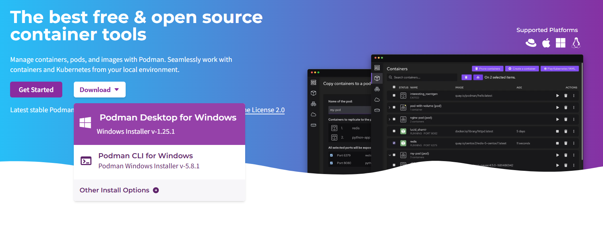

# Podman Desktop for Containerised Applications on Windows


*Podman Desktop.*

## Overview

__Podman__ and Docker are both widely used to build, run, and manage containerised applications. They solve many of the same problems, but there are important differences. Podman is daemonless, which means it does not depend on a long-running background service. It can also run containers rootlessly, which improves security. Podman also aligns closely with the Kubernetes ecosystem and integrates well with platforms such as Red Hat OpenShift, making it a strong choice for cloud-native and enterprise environments.

I have worked extensively with Kubernetes, mainly with Red Hat OpenShift clusters, and I wanted a practical way to test workloads locally before pushing them to a cluster. Because Podman Desktop was developed by Red Hat and provides a visual interface for containers, images, pods, and Kubernetes workflows, it felt like a natural starting point.

This repository documents a series of hands-on exercises I completed while learning Podman Desktop on a Windows machine. The goal is to shorten the learning curve for anyone who wants to build, run, group, and eventually deploy containerised applications using Podman Desktop.

## Online Tutorial Site

The tutorials are available online at:

<https://ayhaidar.github.io/podman-desktop-tutorials/>

## What Is in This Repository?

This repository contains a structured set of hands-on tutorials for using Podman Desktop on Windows:

- __setup_podman_desktop__: install Podman Desktop, configure the Podman machine, handle proxy issues, and run a hello-world container.
- __simple_streamlit_app__: build a basic Streamlit application image and run it as a container.
- __multiple_services__: use Compose to run a dashboard service and a data-puller service together.
- __working_with_pods__: use Podify to group running containers into a Kubernetes-compatible pod.
- __deploy_to_kubernetes__: connect Podman Desktop to a Kubernetes/OpenShift cluster and deploy a pod.

Across the tutorials, the core concepts include containers, images, pods, Podify, Containerfiles, Dockerfiles, volumes, Compose, port forwarding, and Kubernetes deployment.

## Tutorials

- [Setup Podman Desktop](./setup_podman_desktop/)
- [Running a Python Application from Podman Desktop](./simple_streamlit_app/)
- [Setting up Multiple Services: A Dashboard and a Data Puller](./multiple_services/)
- [Podify with Podman Desktop](./working_with_pods/)
- [Deploy Pods to Kubernetes Clusters](./deploy_to_kubernetes/)

## Documentation Site

This repository is ready to publish as a MkDocs Material site. The website source lives in `docs/`, and GitHub Pages deployment is configured in `.github/workflows/pages.yml`.

To preview the site locally:

```powershell
pip install -r requirements-docs.txt
mkdocs serve
```

## Windows Machine

These exercises were completed on a Windows machine. Most concepts also apply to Linux and macOS, but some Windows-specific steps are included, especially around WSL 2, Podman Machine, proxy configuration, and port forwarding.

Windows was selected because it is common in many corporate environments, and container tooling on Windows often requires a few extra steps that are worth documenting.
