# Deploy Pods to Kubernetes Clusters

This tutorial shows how to connect Podman Desktop on Windows to a Kubernetes or OpenShift cluster and deploy a pod from Podman Desktop.

- [1. Deploying to a Kubernetes Cluster Overview](#1-deploying-to-a-kubernetes-cluster-overview)
- [2. Podify with Podman Desktop](#2-podify-with-podman-desktop)
- [3. Setting up a Connection Profile](#3-setting-up-a-connection-profile)
- [4. Viewing the Connection Profile in Podman Desktop](#4-viewing-the-connection-profile-in-podman-desktop)
- [5. Preparing the Pod in Podman Desktop](#5-preparing-the-pod-in-podman-desktop)
- [6. Deploying the Pod to the Remote Cluster](#6-deploying-the-pod-to-the-remote-cluster)
- [7. Viewing Remote Pods from Podman Desktop](#7-viewing-remote-pods-from-podman-desktop)
- [8. Summary](#8-summary)

## 1. Deploying to a Kubernetes Cluster Overview

This exercise targets deploying a pod to a Kubernetes cluster that is reachable from the local Windows machine.

If you have Podman Desktop installed and access to a Kubernetes or Red Hat OpenShift cluster, you can use Podman Desktop to deploy pods to that cluster. This tutorial assumes basic familiarity with Kubernetes concepts such as clusters, namespaces, pods, and kubeconfig files.

In this example, Podman Desktop was connected to a Red Hat OpenShift cluster running on the same network. A kubeconfig connection profile was created first. Then a running container was converted into a pod with Podify and deployed to a namespace in the remote cluster.

This tutorial was guided by the Podman Desktop documentation:

<https://podman-desktop.io/docs/kubernetes/deploying-a-pod-to-kubernetes>

## 2. Podify with Podman Desktop

As shown in the previous exercise, Podify creates a Kubernetes-style pod definition from existing running containers. It translates the live container settings into a Kubernetes YAML definition, but it does not rebuild images or push local images to a registry.

This distinction is important:

- Podify is a translator, not an image builder.
- The Kubernetes cluster must be able to pull the image referenced by the pod.
- Images built only on your local Podman machine are not automatically available to the remote cluster.

For this reason, this exercise uses a public image that the cluster can pull directly:

```text
quay.io/podman/hello
```

If you want to deploy images created in the earlier `multiple_services` tutorial, those images must first be pushed to a registry that the cluster can access, such as Quay, Docker Hub, an internal OpenShift registry, or another private registry.

Although a pod can be created directly in Kubernetes from an image, this exercise focuses on the workflow from Podman Desktop to Kubernetes deployment.

## 3. Setting up a Connection Profile

On Windows, Podman Desktop reads Kubernetes connection details from a kubeconfig file. The default kubeconfig location is usually:

```text
C:\Users\username\.kube\config
```

In this example, access was available through a `kubeadmin` account on an OpenShift cluster.

The required details were:

- the cluster API server URL, such as `https://api.example-cluster.local:6443/`
- the cluster name, such as `example-cluster`
- the username, such as `kubeadmin`
- a login token for that user

In OpenShift, these details can usually be found by logging in through the browser, opening the user menu, and selecting __Copy login command__.

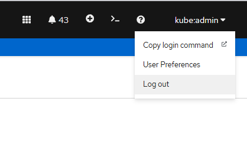

A kubeconfig file for this setup may look similar to the following:

```yaml
apiVersion: v1
clusters:
- cluster:
    insecure-skip-tls-verify: true
    server: https://api.example-cluster.local:6443/
  name: example-cluster
contexts:
- context:
    cluster: example-cluster
    user: kubeadmin
  name: local-admin
current-context: local-admin
kind: Config
preferences: {}
users:
- name: kubeadmin
  user:
    token: <YOUR_TOKEN>
```

You can create or update the connection profile from a terminal using `kubectl`:

```powershell
kubectl config set-cluster example-cluster --server=https://api.example-cluster.local:6443/ --insecure-skip-tls-verify=true
kubectl config set-credentials kubeadmin --token=<YOUR_TOKEN>
kubectl config set-context local-admin --cluster=example-cluster --user=kubeadmin
kubectl config use-context local-admin
```

__Security note:__ `--insecure-skip-tls-verify=true` disables certificate validation. It was used here because the example cluster was running in an internal environment. In production, use a valid certificate authority instead of skipping TLS verification.

## 4. Viewing the Connection Profile in Podman Desktop

After the kubeconfig is configured, Podman Desktop should detect the cluster connection.

Open __Settings -> Preferences -> Kubernetes__ and confirm that the kubeconfig path points to the configured file.

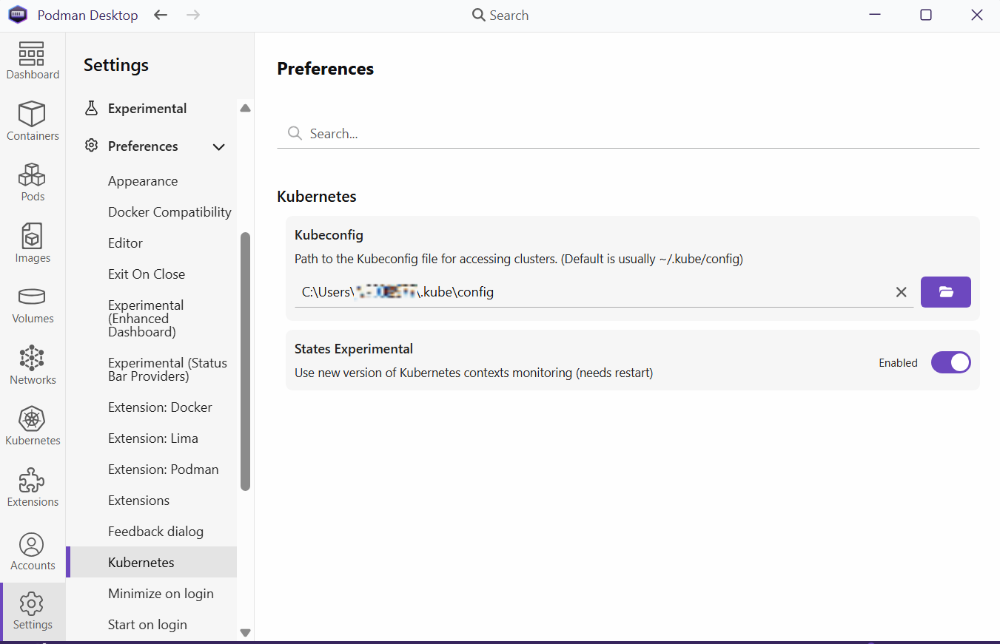

If the connection works, the cluster appears under the Kubernetes settings:

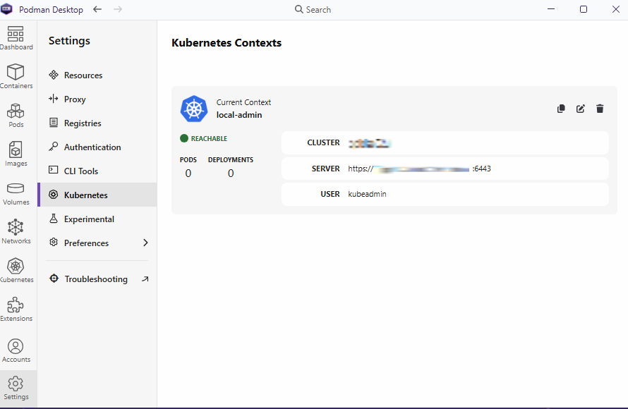

## 5. Preparing the Pod in Podman Desktop

For this exercise, the container uses the public `quay.io/podman/hello` image. Because the image is available in an external registry, the remote Kubernetes cluster can pull it during deployment.

From the __Containers__ tab, I selected the running hello-world container and clicked __Create Pod__.

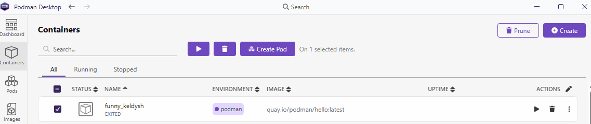

After the pod was created, it appeared in the __Pods__ tab:

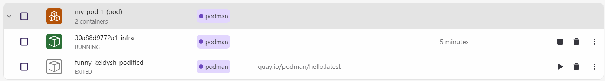

## 6. Deploying the Pod to the Remote Cluster

To deploy the pod to the remote cluster, open the menu beside the pod in the __Pods__ tab and select __Deploy to Kubernetes__.

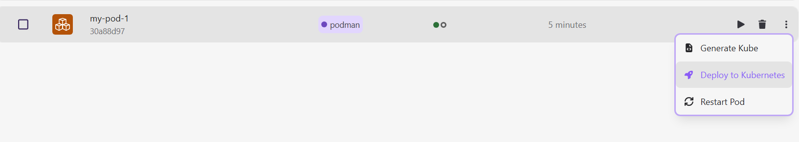

In the deployment settings, select the target namespace. In this example, the namespace is shown as `your-namespace`. Your namespace will be different and must be one you have permission to deploy into.

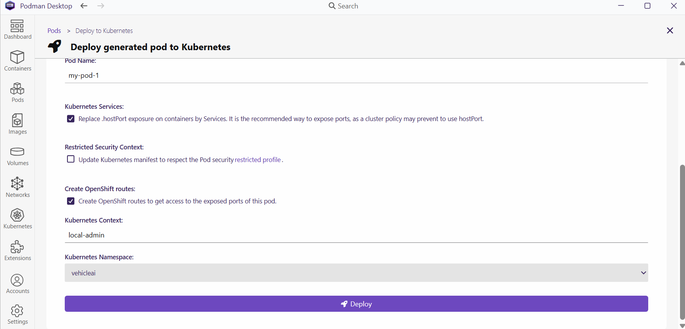

After clicking __Deploy__, Podman Desktop sends the pod definition to the remote cluster.

Once deployed, the pod appears in the target namespace in OpenShift:

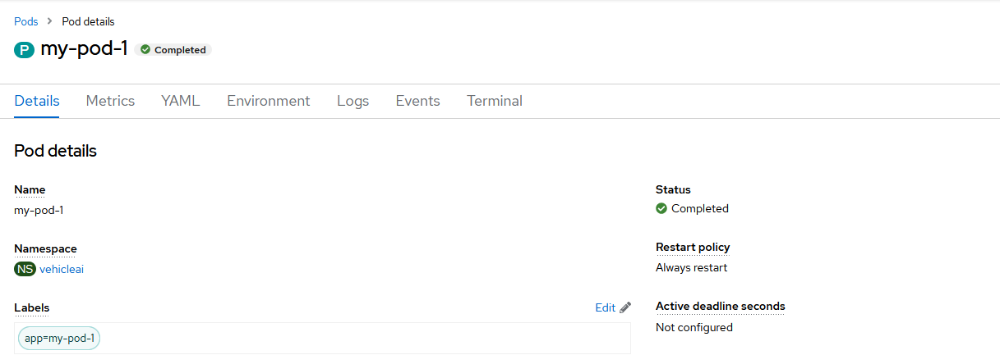

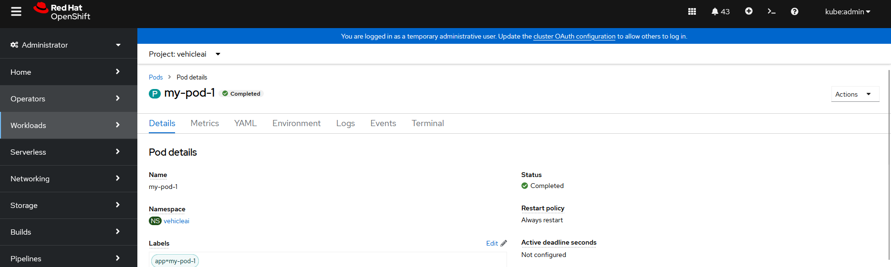

The pod logs can also be viewed from the cluster:

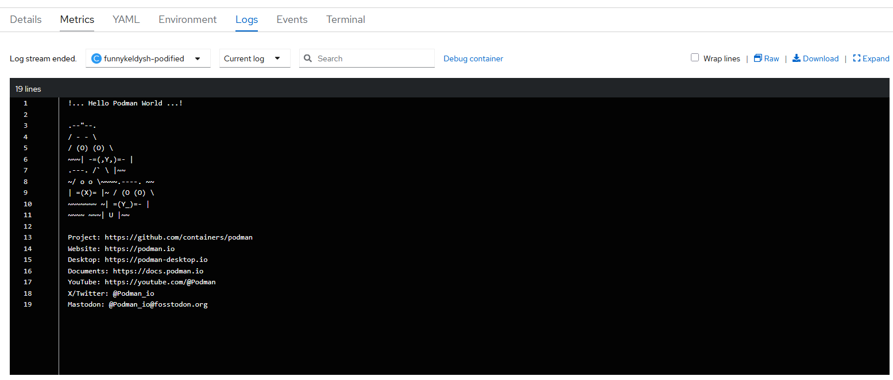

## 7. Viewing Remote Pods from Podman Desktop

Remote Kubernetes resources can also be viewed from the __Kubernetes__ tab in Podman Desktop. For example, the pods and related details in the selected namespace are shown below:

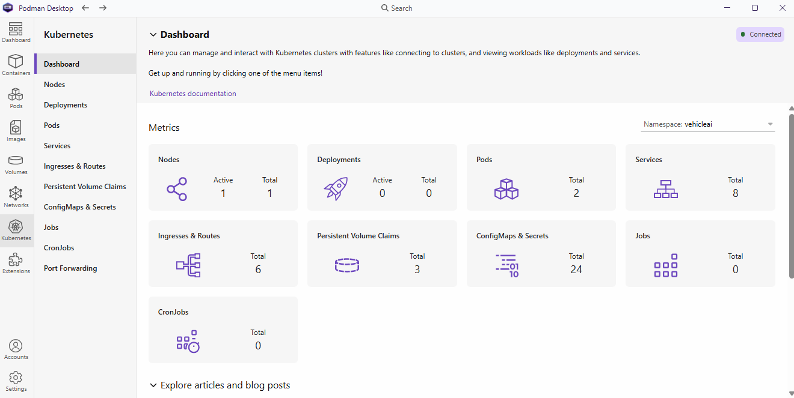

## 8. Summary

This tutorial demonstrated how to connect Podman Desktop to a Kubernetes or OpenShift cluster, create a pod from a running container, and deploy that pod to a remote namespace.

There are many ways to deploy workloads to Kubernetes. This workflow is useful when you prefer a GUI-driven approach and want to move from local Podman Desktop experimentation toward Kubernetes deployment.
