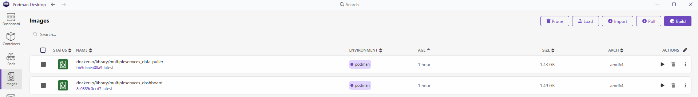
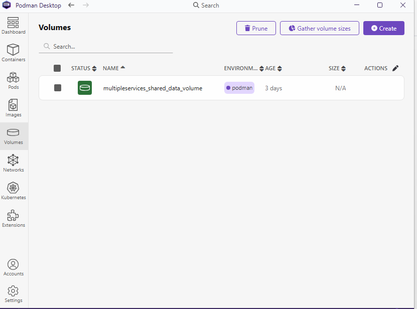
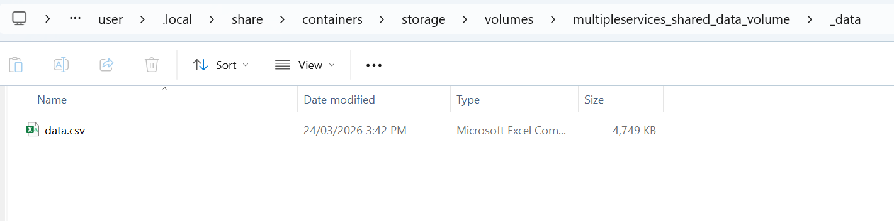
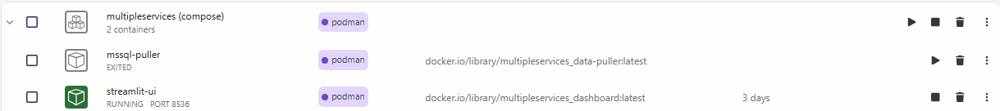
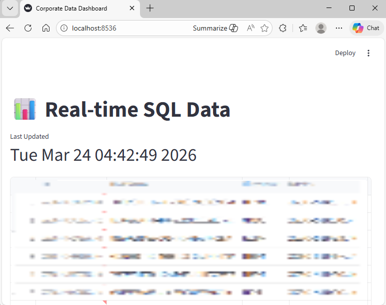

# Setting up Multiple Services: A Dashboard and a Data Puller

This tutorial shows how to run two related services together with Podman Compose:

- a `data-puller` service that connects to a database and exports records
- a `dashboard` service that reads the exported data and displays it in Streamlit

- [1. Podman Compose Overview](#1-podman-compose-overview)
- [2. Storage Overview](#2-storage-overview)
- [3. Creating the Required Files](#3-creating-the-required-files)
- [4. Building Images and Launching Containers](#4-building-images-and-launching-containers)
- [5. Updates Across Podman Desktop](#5-updates-across-podman-desktop)
- [6. Streamlit Dashboard Loading Data](#6-streamlit-dashboard-loading-data)
- [7. Summary](#7-summary)

## 1. Podman Compose Overview

In the `simple_streamlit_app` tutorial, a single dashboard container was created.

In a more realistic scenario, an application may need more than one container. For example, one container may connect to a database and export records, while another container may visualise those records in a dashboard.

Running each container manually would require repeating build, run, networking, volume, and environment configuration steps for every service. Compose solves this by describing the full application in one `compose.yaml` file.

`podman compose` is a convenient way to run a multi-container application. It defines:

- services, which become containers
- networks, which allow services to communicate
- volumes, which provide persistent or shared storage
- ports, which expose container applications to the host
- environment variables, which pass configuration into containers

__Note:__ When using Compose with Podman, either `docker-compose.exe` or `podman-compose.exe` may perform the Compose work behind the scenes. Podman Desktop commonly uses the Docker Compose-compatible workflow. The Docker Compose binary is open source, and using it to talk to Podman is acceptable for this type of workflow.

The following example shows the general structure of a Compose file:

```yaml
name: my-project-name

services:
  app-service:
    build: ./app-folder
    container_name: my-app
    ports:
      - "8080:80"
    environment:
      - DEBUG=true
    volumes:
      - ./src:/app:Z
      - data-store:/data:z
    networks:
      - backend-net
    depends_on:
      - db-service

  db-service:
    image: postgres:latest
    environment:
      POSTGRES_PASSWORD: pass
    volumes:
      - db-data:/var/lib/postgresql/data:z

networks:
  backend-net:
    driver: bridge

volumes:
  data-store:
  db-data:
```

## 2. Storage Overview

Containers are temporary by design. If a container writes data only inside its own filesystem, that data can disappear when the container is removed. For this tutorial, the two services need shared storage: the data puller writes the exported file, and the dashboard reads it.

There are two common approaches.

The first option is a __named volume__. A named volume is managed by Podman and stored inside the Podman environment. This tutorial uses a named volume because it is simple and portable inside the container runtime.

```yaml
services:
  data-puller:
    volumes:
      - shared_data_volume:/var/lib/exports:z

  dashboard:
    volumes:
      - shared_data_volume:/app/dashboard_data:z

volumes:
  shared_data_volume:
    driver: local
```

The second option is a __bind mount__. A bind mount maps a folder from the Windows project directory into the containers. This is useful when you want to inspect or edit files directly from Windows.

```yaml
services:
  data-puller:
    volumes:
      - ./exports:/var/lib/exports:Z

  dashboard:
    volumes:
      - ./exports:/app/dashboard_data:Z
```

When using a bind mount, the top-level `volumes:` section is not required because the path comes from the local filesystem.

## 3. Creating the Required Files

`Containerfile` and `Dockerfile` can be used interchangeably by Podman. In this example, the services use the commonly adopted `Dockerfile` name.

Two services are defined:

- __data-puller__: a Python script connects to a Microsoft SQL Server database, retrieves records, and writes them to the shared named volume. The Microsoft SQL Server driver RPM is included in the `data-puller` folder so the exercise can be followed quickly.
- __dashboard__: a Streamlit application reads the exported dataset from the same named volume and displays it in a table.

The Compose file passes database connection settings into the `data-puller` service through environment variables. The repository includes `.env.example` as a template; copy it to `.env` locally and replace the placeholders with real values only in your private environment.

__Security note:__ SSL verification was disabled while installing some of the required tools in this exercise. That can be acceptable for a controlled learning environment, but it is not recommended in production. Use valid certificates and avoid committing credentials or private connection details to a public repository.

## 4. Building Images and Launching Containers

From the project directory, run:

```powershell
podman compose up -d --build
```

This command builds any service that has a `build:` section and then launches the containers in detached mode.

For example, the `data-puller` service uses:

```yaml
build: ./data-puller
```

Podman Compose looks inside the `data-puller` directory for a `Dockerfile` or `Containerfile`, builds the image, and starts the service.

When the services start successfully, the terminal should show output similar to:

```text
Creating mssql-puller ... done
Creating streamlit-ui ... done
```

## 5. Updates Across Podman Desktop

### Images Tab

After the Compose command completes, the built images appear in the Podman Desktop __Images__ tab. The default prefix may appear as `docker.io/library/...` depending on how Compose names the local images.



### Volumes Tab

Because this tutorial uses a named volume, Podman creates dedicated storage inside the Podman environment:



The following screenshot shows the exported dataset inside the named volume:



To inspect the volume from the command line, run:

```powershell
podman volume inspect multipleservices_shared_data_volume
```

Example output:

```json
[
  {
    "Name": "multipleservices_shared_data_volume",
    "Driver": "local",
    "Mountpoint": "/home/user/.local/share/containers/storage/volumes/multipleservices_shared_data_volume/_data",
    "Labels": {
      "com.docker.compose.project": "multipleservices",
      "com.docker.compose.version": "1.29.2",
      "com.docker.compose.volume": "shared_data_volume"
    },
    "Scope": "local"
  }
]
```

To list all volumes:

```powershell
podman volume ls
```

Example output:

```text
DRIVER      VOLUME NAME
local       multipleservices_shared_data_volume
```

Because Podman is running through WSL 2 on Windows, the volume can also be viewed through the WSL network path:

```text
\\wsl$\podman-machine-default
```

For this example, the volume data is located under:

```text
\\wsl$\podman-machine-default\home\user\.local\share\containers\storage\volumes\multipleservices_shared_data_volume\_data
```

### Containers Tab

The `data-puller` service connects to the database, exports the data, and saves it in the shared volume. The Streamlit dashboard then starts and reads from that same volume.



## 6. Streamlit Dashboard Loading Data

After both services are running, the Streamlit dashboard displays the dataset exported by the data-puller service:



## 7. Summary

This tutorial demonstrated how to run a small multi-service application with Podman Compose. One service retrieves data from an existing database, while the second service displays the exported data in a Streamlit dashboard.

### Podman Compose Connection Note

If Compose appears to connect to Docker instead of Podman, check the active Podman connection:

```powershell
podman system connection ls
```

Select the row where `Default` is `true`:

```text
Name                         URI      Identity    Default     ReadWrite
podman-machine-default       ...      ...         true        true
podman-machine-default-root  ...      ...         false       true
```

Then set `DOCKER_HOST` to the Podman machine pipe in the current PowerShell session:

```powershell
$env:DOCKER_HOST="npipe:////./pipe/podman-machine-default"
```

After setting this value, rerun the Compose command.
