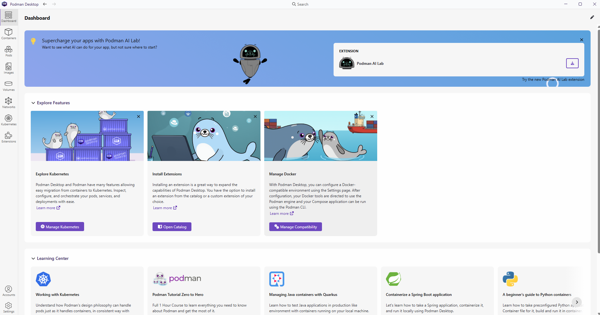
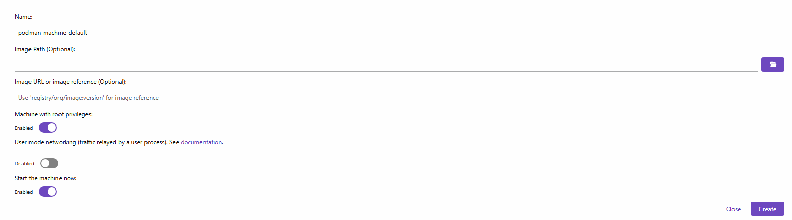
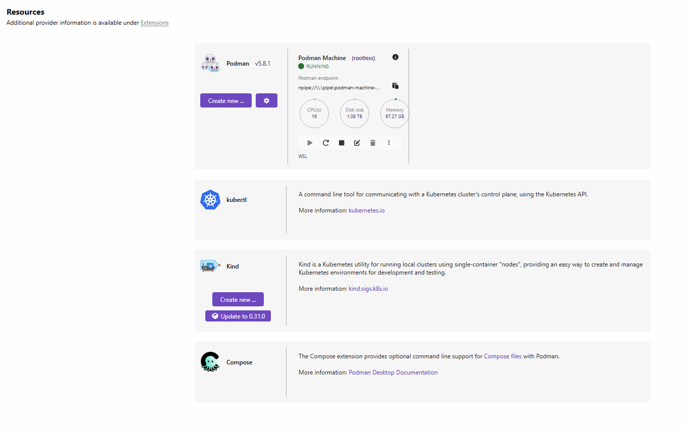
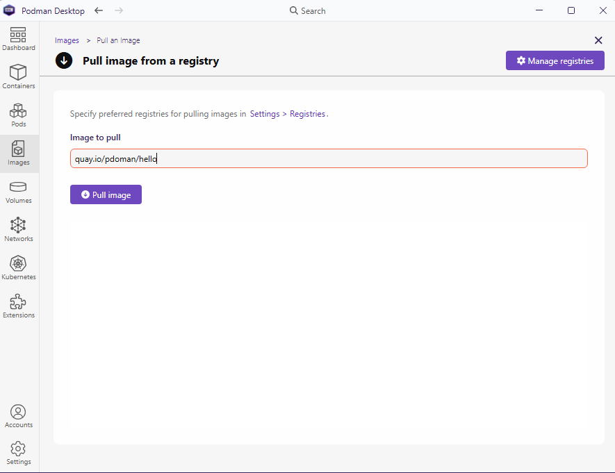
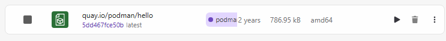
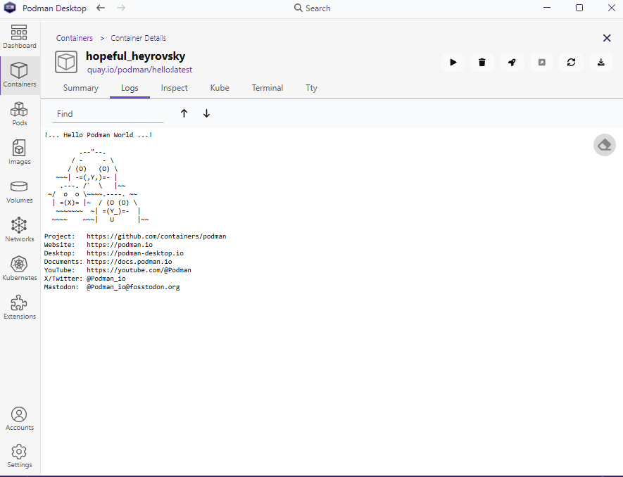

# Setup Podman Desktop

This exercise covers the steps used to install Podman Desktop on Windows, create a Podman machine, handle proxy configuration, and run a hello-world container.

- [1. Downloading Podman Desktop](#1-downloading-podman-desktop)
- [2. Setting up Podman Machine](#2-setting-up-podman-machine)
- [3. Proxy Issues and Setup](#3-proxy-issues-and-setup)
- [4. Hello-World Podman Image](#4-hello-world-podman-image)

## 1. Downloading Podman Desktop

Download Podman Desktop from <https://podman.io/>.

After downloading the installer, I ran `podman-desktop-1.25.1-setup.exe` with administrator privileges so it could be installed for all users on the machine. After installation, the Podman Desktop GUI opened successfully:



## 2. Setting up Podman Machine

A Podman machine on Windows is a lightweight Linux virtual machine that Podman uses to run Linux containers. A Podman machine is required when using Podman on Windows.

On Windows, Podman Machine typically uses Windows Subsystem for Linux 2 (WSL 2) as its backend provider. Containers rely on Linux-specific kernel features, so they cannot run directly on the Windows kernel. WSL 2 bridges that gap by hosting a lightweight Linux environment in the background.

In Podman Desktop, I opened __Settings -> Resources__. Because Podman was not yet installed, Podman Desktop prompted me to create a Podman machine. I selected __Create new__ and kept the default settings:



After the setup completed, the machine appeared as running in the Resources screen:



If the Podman machine becomes unhealthy or needs to be recreated, you can remove and recreate it from the Resources tab in Podman Desktop. The same process can also be completed from a terminal:

```powershell
podman machine stop
podman machine rm podman-machine-default
podman machine init
podman machine start
```

## 3. Proxy Issues and Setup

I wanted to pull images directly from external registries, such as `quay.io/podman/hello`. When using a corporate network, image pulls can fail if the proxy settings are not configured correctly.

To configure the proxy, I opened __Settings -> Proxy__ in Podman Desktop. I selected __Manual__ from the dropdown menu and entered the required proxy details, usually in a format similar to:

```text
http://username@proxy:8080
https://username@proxy:8080
```

This step is not required on a personal machine or on a network that allows direct access to the external internet.

After updating the proxy settings, I recreated the Podman machine and restarted Podman Desktop. I also checked Task Manager to make sure no old Podman Desktop background process was still running. Once restarted, Podman Desktop was able to connect to the internet and pull images.

## 4. Hello-World Podman Image

The first validation step was to pull an image and run a container from it. The Podman hello-world image is:

```text
quay.io/podman/hello
```

In Podman Desktop, I opened the __Images__ tab and searched for `quay.io/podman/hello`.



I selected __Pull Image__ to download the image:



After the image was available locally, I clicked the start arrow beside the image to run it as a container. In the __Containers__ tab, I opened the container details and checked the logs to confirm that it ran successfully:


