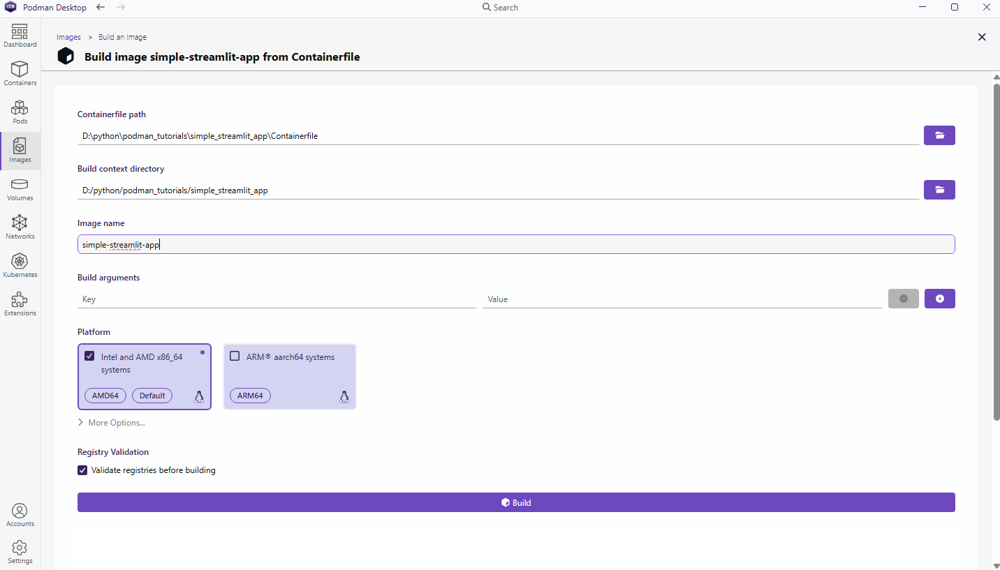
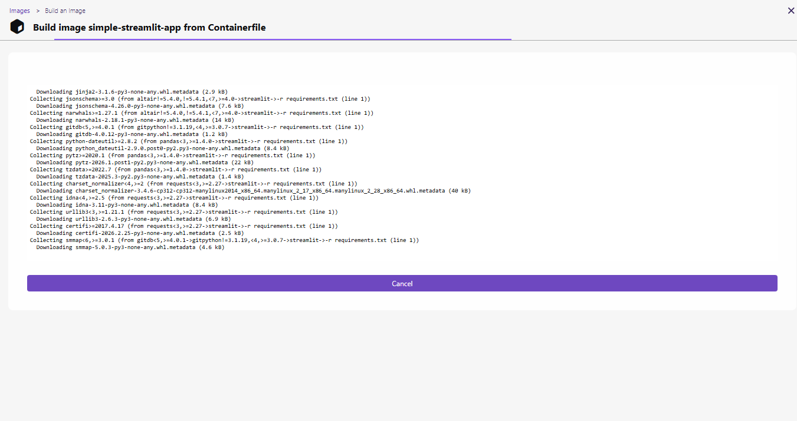
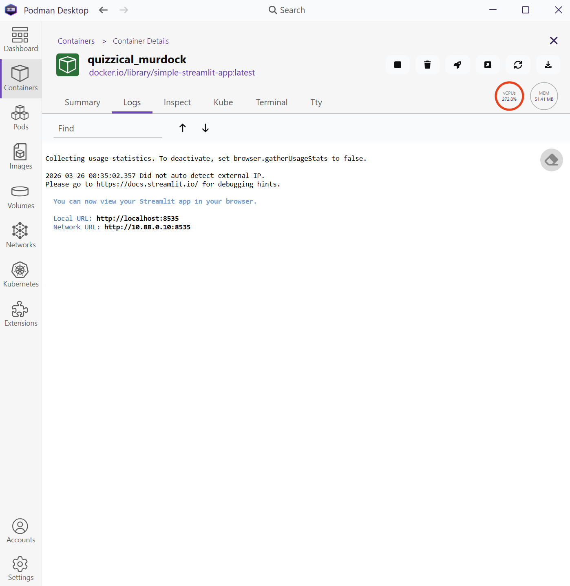
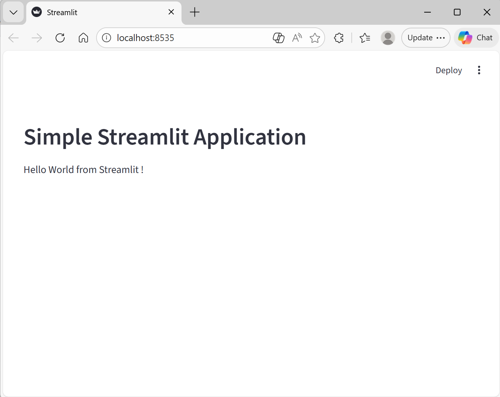

# Running a Python Application from Podman Desktop

This tutorial uses Podman Desktop to build an image from a simple Python Streamlit application and then run that image as a container.

- [1. Creating the Streamlit Python Application Files](#1-creating-the-streamlit-python-application-files)
- [2. Building the Streamlit Application Image](#2-building-the-streamlit-application-image)
- [3. Running the Streamlit Container](#3-running-the-streamlit-container)
- [4. External Access to the Application](#4-external-access-to-the-application)
- [5. Summary](#5-summary)

This tutorial was guided by Red Hat's beginner guide to Python containers:

<https://developers.redhat.com/articles/2023/09/05/beginners-guide-python-containers#build_and_run_the_container>

## 1. Creating the Streamlit Python Application Files

The example application only needs three files:

- `app.py`
- `requirements.txt`
- `Containerfile`

### Streamlit Application (`app.py`)

A simple Streamlit script was used:

```python
import streamlit as st

st.header("Simple Streamlit Application")
st.text("Hello World from Streamlit!")
```

### Dependencies (`requirements.txt`)

Because this is a minimal application, the only dependency is Streamlit:

```text
streamlit
```

### Container File (`Containerfile`)

`Containerfile` is Podman's preferred name for a container build file. It uses the same general syntax as a Dockerfile, and either filename can be used by Podman.

The file does the following:

- selects a Python base image
- copies the dependency file
- optionally supports proxy build arguments
- installs the Python dependencies
- copies the application code into the image
- exposes the Streamlit port
- starts the Streamlit application

```Dockerfile
FROM quay.io/fedora/python-312

LABEL org.opencontainers.image.authors="your-name@example.com"

COPY requirements.txt requirements.txt

# Optional proxy settings for corporate networks:
# ARG http_proxy=http://username@proxyserver:8080
# ARG https_proxy=https://username@proxyserver:8080

RUN pip3 install -r requirements.txt

COPY . .

EXPOSE 8535

CMD ["python3", "-m", "streamlit", "run", "app.py", "--server.port=8535"]
```

## 2. Building the Streamlit Application Image

After the `Containerfile` was ready, I used Podman Desktop to build the image.

From the __Images__ tab, I selected __Build__, filled in the required details, selected the folder that contains the `Containerfile`, and clicked __Build__.



Podman Desktop displayed the build logs while the image was being created:



## 3. Running the Streamlit Container

After the image was built, I clicked the run arrow beside the image to create and start a container.

The running container then appeared in the __Containers__ tab:



Once the application started, I opened the exposed port in a browser and confirmed that the Streamlit app was running:



## 4. External Access to the Application

You may want to access the containerised application from another computer on the same network. On Windows, this usually requires port forwarding from the Windows host to the Podman machine running inside WSL 2.

Run the following command in a PowerShell terminal with administrator privileges:

```powershell
wsl -d podman-machine-default ip addr show eth0
```

Find the IP address returned for `eth0`, then replace `replacehere` in the command below with that IP address:

```powershell
netsh interface portproxy add v4tov4 listenport=8535 listenaddress=0.0.0.0 connectport=8535 connectaddress=replacehere
```

This creates a persistent Windows listener on port `8535`. Even after the Podman container is stopped or removed, Windows keeps the port proxy rule until it is deleted.

To remove the port forwarding rule, run:

```powershell
netsh interface portproxy delete v4tov4 listenport=8535 listenaddress=0.0.0.0
```

## 5. Summary

This tutorial demonstrated how to build a simple Python Streamlit application image with Podman Desktop, run it as a container, and optionally expose it to other machines on the same network.
