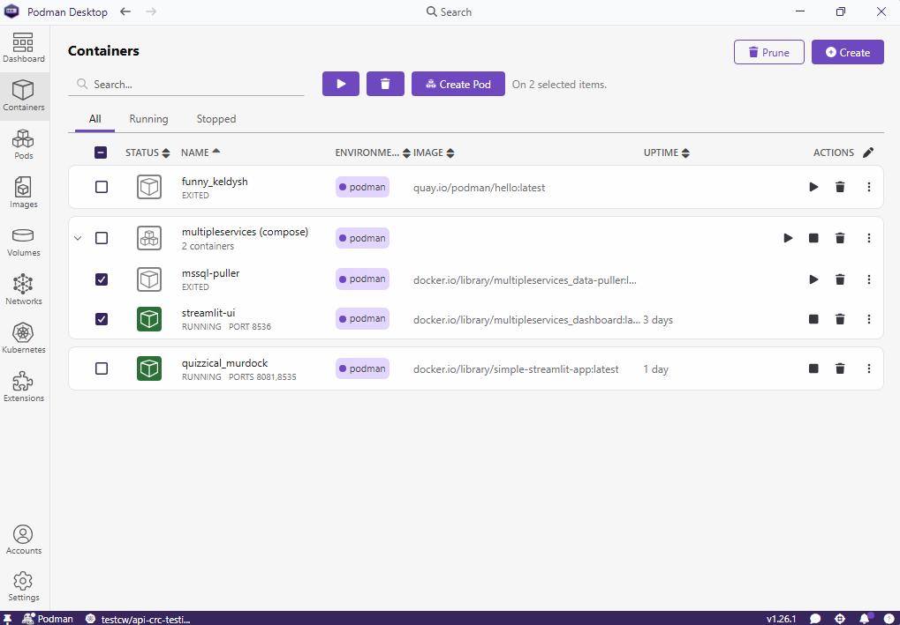
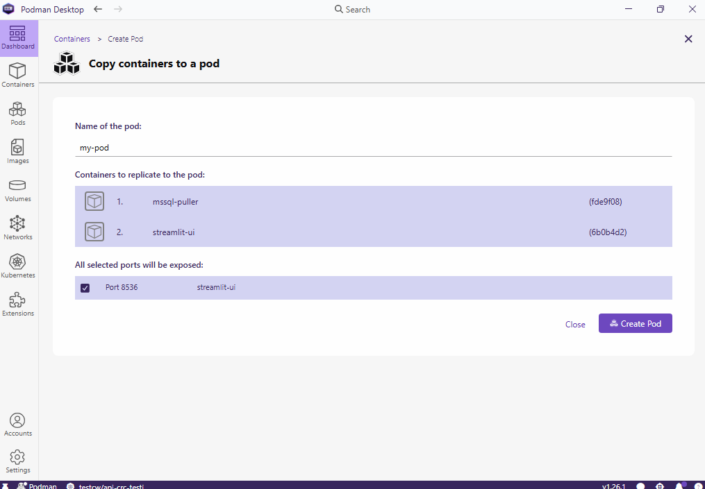
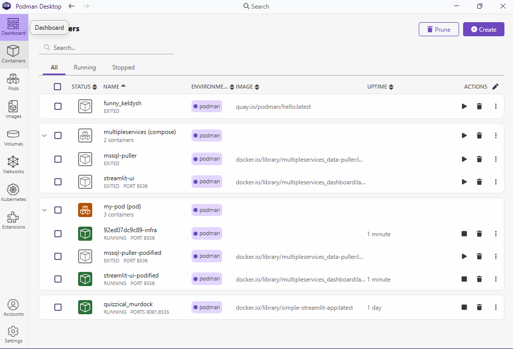
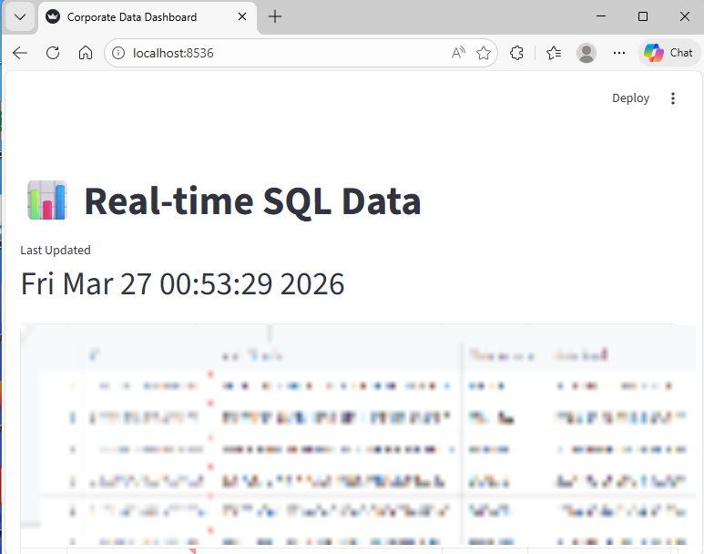

# Podify with Podman Desktop

This tutorial shows how to use Podify in Podman Desktop to group existing containers into a Kubernetes-compatible pod.

- [1. Podify Overview](#1-podify-overview)
- [2. Creating a Pod with Podify](#2-creating-a-pod-with-podify)
- [3. Running the Application from the Pod](#3-running-the-application-from-the-pod)
- [4. Summary](#4-summary)

## 1. Podify Overview

Podify is a Podman Desktop feature that takes one or more existing containers and groups them into a single Kubernetes-compatible pod.

A pod is useful when multiple containers should live together as one unit. Containers inside the same pod share the same network namespace, which means they can communicate through `localhost`. They can also share mounted storage when configured to do so.

When containers are created separately with Compose, each container normally has its own network identity. When those containers are grouped into a pod, they are treated more like a Kubernetes workload: the pod becomes the unit that can be described, moved, and deployed.

In other words, containers package the application processes, while pods describe how related containers live and communicate together.

This tutorial was guided by the following Podman Desktop article:

<https://podman-desktop.io/blog/2024/10/05/kubernetes-blog>

Continuing from the previous exercise, assume that the `data-puller` and `dashboard` containers should run in the same pod. From the __Containers__ tab, select the two running containers.

When the __Create Pod__ button appears, click it.

## 2. Creating a Pod with Podify

Enter a pod name, expose the required ports, and click __Create Pod__.

Back in the __Containers__ tab, a new pod grouping appears:

## 3. Running the Application from the Pod

The dashboard application is available through the exposed port configured during pod creation.

## 4. Summary

This exercise introduced Podify in Podman Desktop. Podify is useful when you want to take running containers and turn them into a pod-like workload that aligns more closely with Kubernetes concepts.
